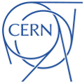

# SixTrack

SixTrack is a single particle 6D symplectic tracking code optimized for long term tracking in high energy rings.
It is mainly used for the LHC for dynamic aperture studies, tune optimization, and collimation studies.

## Authors

F.&nbsp;Schmidt (DESY, CERN),
J.D.&nbsp;Andersson,
R.&nbsp;Assman,
J.&nbsp;Barranco,
V.K.&nbsp;Berglyd&nbsp;Olsen,
C.&nbsp;Bracco,
R.&nbsp;Bruce,
R.&nbsp;De&nbsp;Maria,
M.&nbsp;Fiascaris,
M.&nbsp;Fjellstrom,
H.&nbsp;Grote,
K.&nbsp;Heinemann,
F.&nbsp;James,
K.&nbsp;Koelbig,
R.&nbsp;Kwee-Hinzmann,
Y.&nbsp;Levinsen,
E.&nbsp;Mcintosh,
A.&nbsp;Mereghetti,
D.&nbsp;Mirarchi,
K.&nbsp;Paraschou,
T.&nbsp;Persson,
V.&nbsp;Previtali,
E.&nbsp;Quaranta,
H.&nbsp;Ranshall,
S.&nbsp;Redaelli,
A.&nbsp;Rossi,
A.&nbsp;Santamaria,
K.&nbsp;Sjobak,
Y.&nbsp;Sun,
C.&nbsp;Tambasco,
M.&nbsp;Vaenttinen,
J.F.&nbsp;Wagner,
T.&nbsp;Weiler,
J.&nbsp;Wretborn (CERN),
M.&nbsp;Fitterer (FNAL, CERN),
V.&nbsp;Gupta (Google Summer of Code),
S.&nbsp;Kostoglou (NTUA, CERN),
J.&nbsp;Molson (UMAN, LAL, CERN),
A.&nbsp;Patapenka (NIU, CERN),
G.&nbsp;Robert-Demolaize (BNL, CERN)

**Core Devs:**
V.K.&nbsp;Berglyd&nbsp;Olsen,
R.&nbsp;De&nbsp;Maria,
A.&nbsp;Mereghetti,
J.&nbsp;Molson,
T.&nbsp;Persson,
K.&nbsp;Sjobak.

## License

Copyright 2019 CERN. This software is distributed under the terms of the GNU Lesser General Public License version 2.1, copied verbatim in the file [LICENSE.md](LICENSE.md).

In applying this licence, CERN does not waive the privileges and immunities granted to it by virtue of its status as an Intergovernmental Organization or submit itself to any jurisdiction.

## Quick Build

To build the standard release version of SixTrack, run the script `cmake_six` with no additional options.
This will build the SixTrack 64 bit executable with the singletrackfile, zlib support, as well as the crlibm math library.

## Resources

  * Main Website: [sixtrack.web.cern.ch/SixTrack](http://sixtrack.web.cern.ch/SixTrack/)
  * Documentation: [PDF](http://sixtrack.web.cern.ch/SixTrack/docs/user_manual.pdf) | [HTML](http://sixtrack.web.cern.ch/SixTrack/docs/user_full/manual.php)

## Source Code

  * [ChangeLog](CHANGELOG.md)
  * [Development Cheat Sheet](doc/dev_cheatsheet.md)

## Building SixTrack

  * [General Requirements and Build Options](doc/build_sixtrack.md)
  * Further details covered in the [build manual](http://sixtrack.web.cern.ch/SixTrack/docs/building_sixtrack.pdf)

## Developer Tools

  * [A MAD-X/SixTrack output testing and comparison framework](devtools/physicsBenchmark/README.md)
